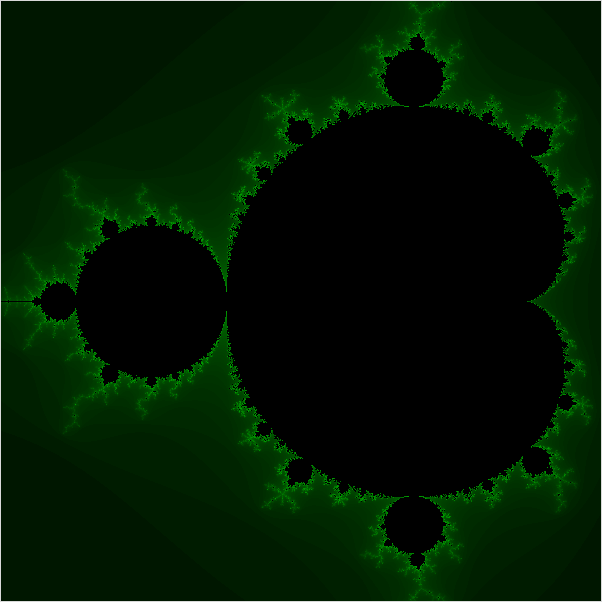

# 2is50-2019-2020-ha-1

* Authors: Lars van den Haak and Tom Verhoeff (TU/e)
* Contributor 1: Harry Verspagen
* TU/e ID number 1: 1484575
* Contributor 2: Sander Debets
* TU/e ID number 2: 1252402
* Date: 04-05-2020

# The Mandelbrot set

In mathematics, the Mandelbrot set is a fractal.
This means you can zoom in indefinitely and the same patterns will occur.
In this assignment you will be making a Mandelbrot yourself.

## Configuration
After you cloned this repository, open it in PyCharm.
Reuse your environment from Homework Assignment 0,
and install all additionally required packages from `requirement.txt`.

## Starting point

We’ve provided three files which are the starting point of this
assignment. In the file `src/mandel.py` you should define the functions,
which we already named. In the file `src/gui.py`, we provided a
basic Graphical User Interface (GUI) such that we get results on the
screen. It is made using Tkinter. Finally, the
`src/main.py` file calls the functions defined in the other
files, and has the main loop that keeps the interface running.

**Note:** We only provided the function names, and arguments.

Check [this PDF](https://gitlab.tue.nl/study-material-for-2is50/study-material-2is50-2019-2020-q4/-/blob/master/assignments/1_HA/Assignment1Mandelbrot.pdf) file for the actual assignment.
